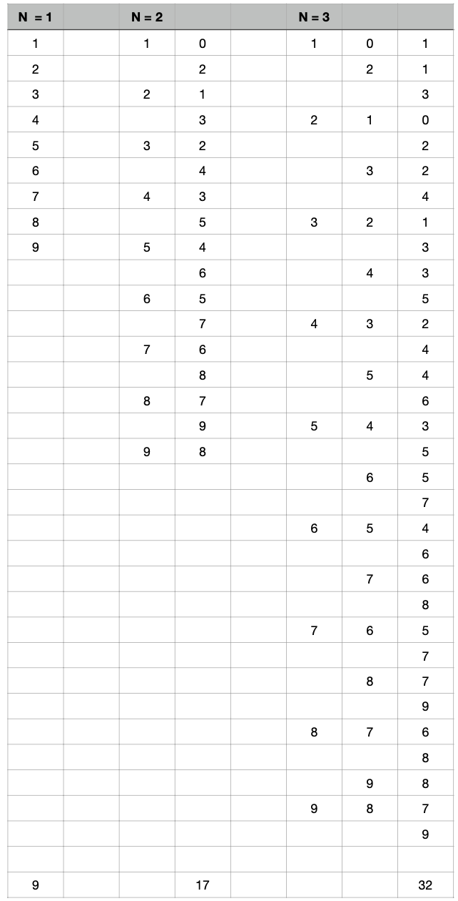
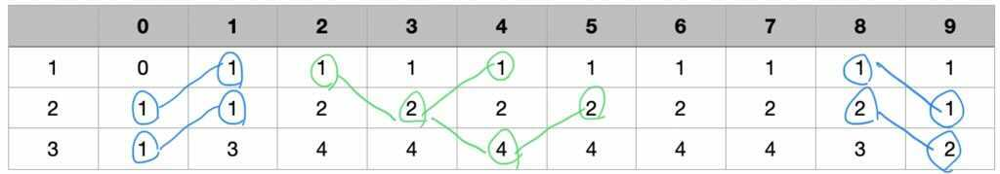

<hr>
<font size="2em" color="green">2021.04.23</font>
## 쉬운 계단 수
45656이란 수를 보자.<br>
이 수는 인접한 모든 자리수의 차이가 1이 난다. 이런 수를 계단 수라고 한다.<br>
세준이는 수의 길이가 N인 계단 수가 몇 개 있는지 궁금해졌다.<br>
N이 주어질 때, 길이가 N인 계단 수가 총 몇 개 있는지 구하는 프로그램을 작성하시오. (0으로 시작하는 수는 없다.)<br><br>

- 입력 조건<br>
-- 첫째 줄에 N이 주어진다. N은 1보다 크거나 같고, 100보다 작거나 같은 자연수이다.<br>

- 출력 조건<br>
-- 첫째 줄에 정답을 1,000,000,000으로 나눈 나머지를 출력한다.<br><br>

<hr><br> 
- 발생할 수 있는 경우의 수는 아래와 같다.<br><br>

<br><br>
- 마지막 자리가 0~9 일경우를 정리해보면 아래와 같다.<br>
0와 9일 경우엔 각각 N-1의 우측/좌측 대각선 값과 같고,<br>
나머지의 경우에는 N-1의 양쪽 대각선의 합과 같다.<br>
<br>

<br>

```python
N = int(input())

dp = [[0]*10 for _ in range(N)]
dp[0] = [0, 1, 1, 1, 1, 1, 1, 1, 1, 1]

for i in range(1, N):
    for j in range(10):
        if j == 0:
            dp[i][j] = dp[i-1][j+1]
        elif j == 9:
            dp[i][j] = dp[i-1][j-1]
        else:
            dp[i][j] = dp[i-1][j-1] + dp[i-1][j+1]

print(sum(dp[N-1]) % 1000000000)
```
<br>
<hr>

<br>
🔽 앱 동작 사진

