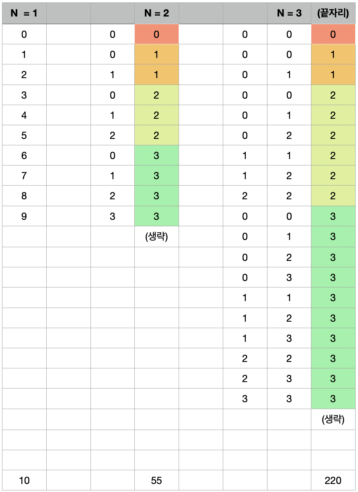
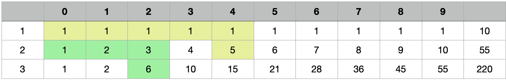

<hr>
<font size="2em" color="green">2021.05.01</font>
## 오르막 수 

오르막 수는 수의 자리가 오름차순을 이루는 수를 말한다. 이때, 인접한 수가 같아도 오름차순으로 친다.<br>
예를 들어, 2234와 3678, 11119는 오르막 수이지만, 2232, 3676, 91111은 오르막 수가 아니다.<br>
수의 길이 N이 주어졌을 때, 오르막 수의 개수를 구하는 프로그램을 작성하시오. 수는 0으로 시작할 수 있다.<br><br>

- 입력 조건<br>
-- 첫째 줄에 N (1 ≤ N ≤ 1,000)이 주어진다.<br>

- 출력 조건<br>
-- 첫째 줄에 길이가 N인 오르막 수의 개수를 10,007로 나눈 나머지를 출력한다.<br><br>

<hr><br> 
- 발생할 수 있는 경우의 수는 아래와 같다.<br><br>

<br><br>
- 마지막 자리가 0~9 일경우를 정리해보면 아래와 같다.<br>
N-1번째의 0~i번째의 합이 해당 값이다.<br>
<br>

<br>

```python
N = int(input())

dp = [[0]*10 for _ in range(N)]
dp[0] = [1, 1, 1, 1, 1, 1, 1, 1, 1, 1]

for i in range(1, N):
    for j in range(10):
        tmp = 0
        for k in range(j+1):
            tmp += dp[i-1][k]
        dp[i][j] = tmp


print(sum(dp[N-1]) % 10007)
```
<br>
<hr>
