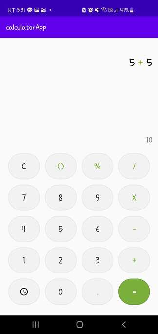
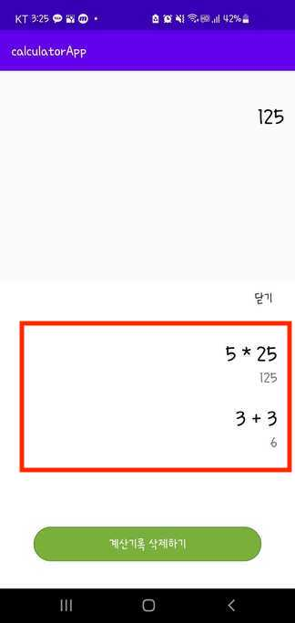

<br><br>
## 1. 배경
이번엔 계산기 앱이다. TableLayout을 사용하고, Room으로 이력을 저장하는 등 간단한 형식의 앱이었지만,<br>
아래 사진의 빨간색으로 표시된 계산 이력 레이아웃에서 구현 방식이 새로워서 정리해 두고 가려고 한다.

<br>
🔽 앱 동작 사진
 

<br><br>

## 2. LayoutInflater
나였다면, RecyclerView를 써서 해당 뷰를 표현했을 것같다. 그러나, 여기서는 좀 더 간단하게 표현했다.<br>
ScrollView안에 LinearLayout을 추가하고, <br>
Inflater로 새로운 뷰를 만들어서 값을 대입한 후 addView 함수로 붙여주었다.<br>

무작정 Recyclerview가 아니라 이런식으로 간단하게 표현할 수 있다는게 신기했다.

```kotlin
<ScrollView
    android:layout_width="0dp"
    android:layout_height="0dp"
    android:layout_margin="10dp"
    app:layout_constraintBottom_toTopOf="@id/btn_history_clear"
    app:layout_constraintEnd_toEndOf="parent"
    app:layout_constraintStart_toStartOf="parent"
    app:layout_constraintTop_toBottomOf="@id/btn_history_close">

    <LinearLayout
        android:id="@+id/ll_history"
        android:layout_width="match_parent"
        android:layout_height="wrap_content"
        android:orientation="vertical" />

</ScrollView>
```

``` kotlin
Thread(Runnable {
    db.historyDao().getAll().reversed().forEach { //DB에서 계산 이력 데이터 불러오기
        runOnUiThread {
            val historyView = LayoutInflater.from(this).inflate(R.layout.history_row, null, false)
            historyView.findViewById<TextView>(R.id.tv_expression).text = it.expression
            historyView.findViewById<TextView>(R.id.tv_result).text = " ${it.result}" //값 대입

            historyLinearLayout.addView(historyView) // view 붙여넣기
        }
    }
}).start()
```

<br><br>
## 3. 코드
전체 코드는 [여기서](https://github.com/jwl-97/Android_calculatorApp) 볼 수 있다.
<br><br>
