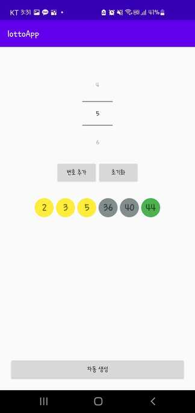

<br><br>
## 1. 배경
요새 같은 코드만 보고 있자니 이게 맞게 하고 있는건가 라는 생각이 들때쯤, 인터넷 강의 광고를 하나 보게 되었다.  <br>
java로 구현된거나 겉핡기식이 아니라 쉽게는 레이아웃부터 클린아키텍쳐, koin, cameraX까지 커리큘럼이 나름 괜찮았다.<br>
다만, 순차적으로 나오는거라서 내가 원하는거 들을 때 까지는 몇 달을 기다려야했지만, 이틀전 첫 강의가 오픈되어 가벼운 마음으로 보기 시작했다.<br><br>
기초와 첫강의는 어느정도 건너뛰고 두번째 강의를 들을 때, 아 역시 다른 사람 코드를 많이 봐야 하는구나 라고 생각이 들었다.<br>
새롭게 느껴졌던 코드를 몇 개 정리해 두고 가려고 한다.

<br>
🔽 앱 동작 사진


<br><br>

## 2. ConstraintLayout
나는 실무에서 대부분 RelativeLayout과 LinearLayout을 사용했다.<br>
LinearLayout을 그리는 속도가 제일 늦다고 해서 거의 RelativeLayout을 사용했었는데, 사용하다보면 <br>
같은 레이아웃을 나눠쓴다거나 일정 비율을 맞춰야하는 경우가 발생할 떄 LinearLayout을 어쩔 수 없이 쓰곤 했다.<br>

강의를 보다보니 ConstraintLayout를 접하게 되었고, 하나 하나 이어줘야한다는게 아직 어색하지만, 그만큼 레이아웃을 자유자재로 쓸 수 있어서 좋은 것 같다. 익숙해지면 굉장히 편해질 것 같다.<br>

``` kotlin
    app:layout_constraintLeft_toLeftOf="parent"
    app:layout_constraintRight_toLeftOf="@id/btn_reset"
    app:layout_constraintTop_toBottomOf="@id/numberPicker"
    
    /**
    각각의 constraintTop / constraintLeft / constraintRight / constraintBottom에 추가로,
    toLeftOf / toRightOf / toTopOf / toBottomOf를 붙여서 간격을 설정할 수 있다.
    */
```
``` kotlin
    app:layout_constraintHorizontal_chainStyle="packed"
    /**
    chainStyle을 통해 같은 가로(horizontal)를 나누어 쓸 때 각각의 항목이 붙어있을지 멀리 떨어져 있을지 선택할 수 있다.
    */
```

<br><br>
## 3. Xml visible
화면을 구성하다보면 데이터가 보여지는 타이밍이나 항목에 따라 뷰를 gone 시켰다가 다시 visible 시키는 경우가 있다.<br>
하지만 gone을 시키면 xml에서도 안보이기 때문에 불편한 경우가 있었는데, `android:visibility`은 gone시키고,<br> `tools:visibility`은 visible로 두면 실제 뷰에서는 안보이지만, xml상에서는 보이게 처리할 수 있다.

```kotlin
 android:visibility="gone"
 tools:visibility="visible" 
```
<br><br>
## 4. 연속되는 Textview 리스트화
연속되는 TextView를 list로 담아 한 번에 초기화 하고 꺼내오는 코드가 있었다.<br>
나였으면, 일일히 초기화를 해서 코드가 훨씬 더 길어졌을 텐데 리스트화하니까 가독성도 좋아지고, <br>
visible 처리나 text를 적용해줄 때, forEach나 forEachIndexed를 사용해서 한번에 쉽게 적용할 수 있었다. 


```kotlin
private val numberTextviewList: List<TextView> by lazy {
    listOf<TextView>(
        findViewById<TextView>(R.id.tv_num1),
        findViewById<TextView>(R.id.tv_num2),
        findViewById<TextView>(R.id.tv_num3),
        findViewById<TextView>(R.id.tv_num4),
        findViewById<TextView>(R.id.tv_num5),
        findViewById<TextView>(R.id.tv_num6)
    )
}
```

```kotlin
numberTextviewList.forEachIndexed { index, textview ->
    textview.visibility = View.VISIBLE
    textview.text = result[index].toString()
}
```

<br><br>
## 5. 코드
전체 코드는 [여기서](https://github.com/jwl-97/Android_lottoApp) 볼 수 있다.
<br><br>
